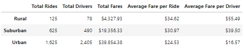
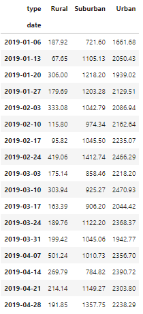
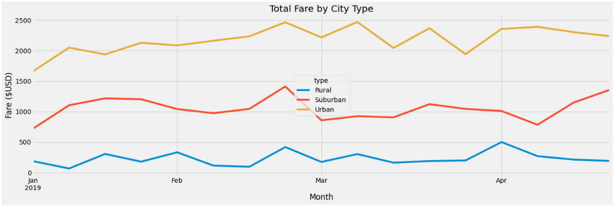

# Module 5 Challenge - PyBer Ride Sharing Analysis
An analysis was performed and visualizations of the data was created regarding PyBer rideshare data from January to May 2019 to help improve access to ride-sharing services and affordability for underserved neighborhoods. 

## Summary of Tasks
* Inspected CSV input files
* Merge City and Ride data for analysis
* Calculate the Following Metrics:
  * Total Number of Rides by City Type
  * Total Number of Drivers by City Type
  * Total Amount ($) of Fares Collected By City Type
  * Total Weekly Amount ($) of Fares Collected City Type
* Create Visual Graph Charting Total Monthly Fares Collected by City Type

## Resources
- Data Source: city_data.csv, ride_data.csv
- Software: Python 3.9.12, Jupyterlab 3.3.2, Pandas 1.4.2, MatPlotLib 3.5.1

## Summary of Results
### Summary of Rides, Drivers and Faires per City TYpe

### Summary of Weekly Fares Collected per City Type from January thru April 201

### Total Fare by City Type Visualization

## Final Conclusion Statement
An analysis of the data reveals that there are considerably more drivers and rides taked in Urban cities than in Suburban cities, and especially in Rural areas. Surburban ride requests are 5 times more than Rural, and Urban cities have 2.6 times more than suburban, and 13 times more than rural cities. What is interesting is that in Rural and Suburban areas there are approximately 1 (or 1.6 for Rural and 1.3 for Surburban to be exact) driver per ride. In Urban areas, there are far more drivers than ride requests, almost 2 drivers per ride. The average cost of a ride in Rural areas is almost $10 more than urban areas, but average fares collected by drivers in Rural area is almmost 3.4 times mor than in urban areas. It seems drivers make more in Rural areas than in Urban area because there is hardly any competition.

For the most part, Urban and Suburban fares collected match each other on monthly basis (See Chart). Rural fares collected are slowly increase, but with very small increases. 

### Recommendation #1
Based on plain supply and demanad economics, the over abundance of drivers and a lack of ride demand to match forced the cost of rideshare to be half or more than half the the cost of Suburban and Rural areas. If more drivers can be created or added to the Surburban and especially in the Rural areas, perhaps the price/fare would decrease, making it more affordable, therefore increasing the number of riders.

### Recommendation #2
There is a noticeable drip in faares collected within all three areas in March. In fact, there was a surge at the end of February, and then a dip in the beginning of March. Recommended finding out what holidays or events occurred during that timeframe. Perhaps there was a system glitch that prevented usage of the system.

### Recommendation #3
Identify events on a weekly or monthly basis within the surburban and rural areas. For those events, advertise and sponsor some of these events to increase potential rider knowledge of the company services, and to also promote new drivers to join.
